- [[Todos]]
	- NOW [研究生都快去申请Tinker Research Grant](https://www.xiaohongshu.com/explore/690d19020000000003038daa?note_flow_source=wechat&xsec_token=CBOhi8ogX92S493HfZltnpED-bP15j61EyTHKH2aT1QrE=)
	  :LOGBOOK:
	  CLOCK: [2025-11-14 Fri 20:57:22]
	  :END:
- [[Papers]]
	- #spatial-Intelligence [谢赛宁、李飞飞、LeCun联手提出多模态LLM新范式，「空间超感知」登场](https://mp.weixin.qq.com/s/H7K8DQ4ztbO138R_STBDRQ)
	  collapsed:: true
		- ## 概述
		  collapsed:: true
			- 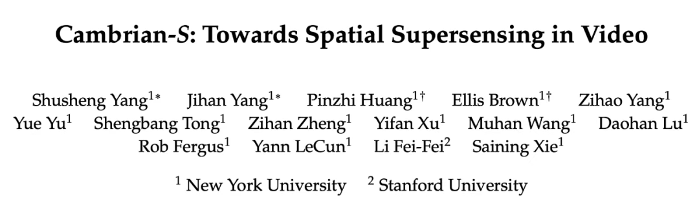{:width 500}
				- **论文标题**： Cambrian-S: Towards Spatial Supersensing in Video
				- **论文地址**： https://arxiv.org/pdf/2511.04670
				- **项目主页**： https://cambrian-mllm.github.io/
				- **代码地址**： https://github.com/cambrian-mllm/cambrian-s
			- 纽约大学助理教授谢赛宁新作又来了，合著者还有李飞飞、Yann LeCun。
			- 这次的成果名为「**Cambrian-S**」，根据谢赛宁的说法，它既是一种观点，也是一个数据集、一个基准或者一个模型，代表其迈出了探索视频空间超感知的第一步。
			- 从名称上来看，Cambrian-S 是谢赛宁团队去年研究成果「Cambrian-1」的延续。Cambrian-1 是一个关于图像 MLLM 的开放项目，旨在让 AI 获得强大的视觉表征学习能力。具体详见：寒武纪 1 号诞生：[谢赛宁、Yann LeCun 团队发布最强开源多模态 LLM](https://mp.weixin.qq.com/s?__biz=MzA3MzI4MjgzMw==&mid=2650923675&idx=1&sn=2df90e60fcfde31ee76054f4d14249e3&scene=21#wechat_redirect)
			- 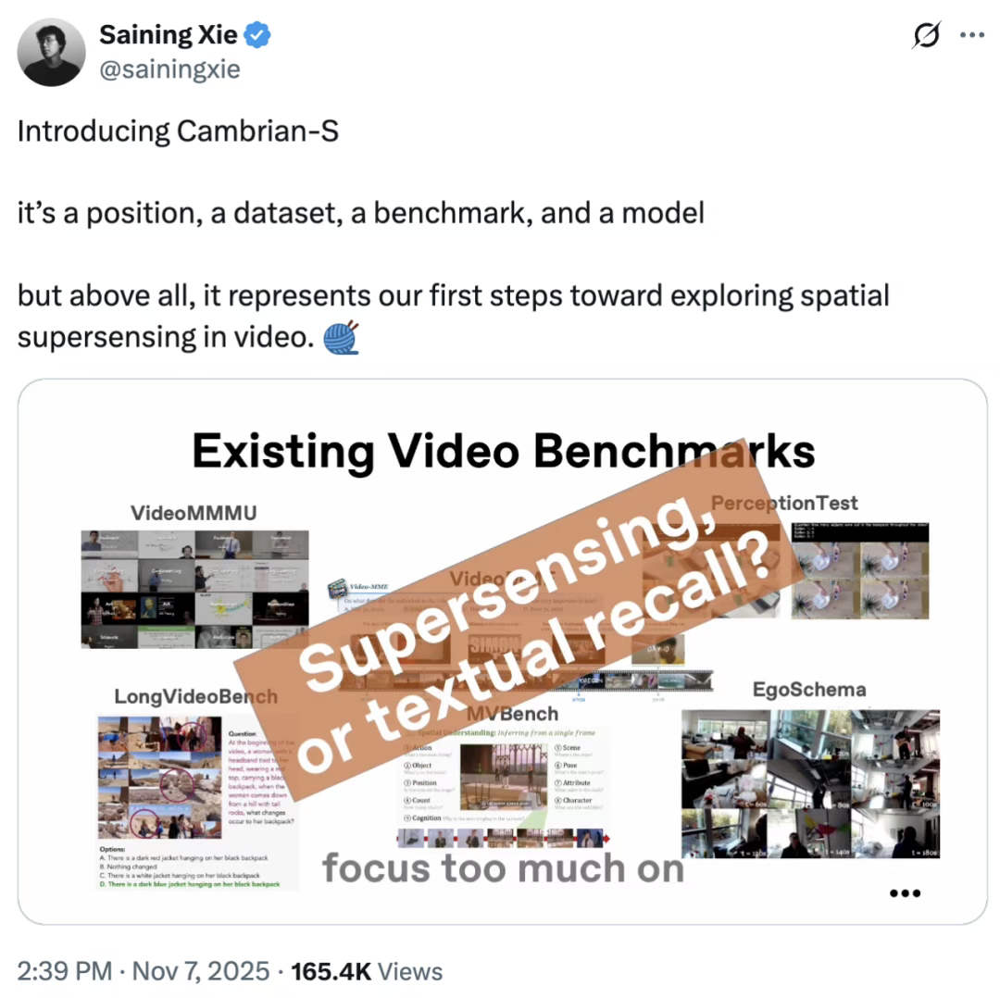{:width 400,:height 800}
			- 在构建 Cambrian-1 之后，团队并没有立即扩展到 Cambrian-2 或 3，而是停下来思考以下三个问题：
				- 1）什么才是真正的多模态智能？
				- 2）LLM 范式对感知建模是否真的合适？
				- 3）为什么人类的感知如此轻松、直觉，却又如此强大？
			- 在思考这些问题下，他们意识到某种根本性的东西缺失了，因此认为**在构建「超级智能」之前，必须先构建「超感知」（supersensing）**。
			- 那么，如何定义超感知呢？在他们的语境中，超感知不是指更先进的传感器或更好的摄像头，而是**指一个数字生命体如何真正体验世界 —— 它能够吸收无尽的输入流，并从中不断学习**。超感知是智能的一部分，就像眼睛是大脑感知外部世界的那部分。你不需要感知就能解决代码或数学问题，但是如果 AI 要在现实世界中成为智能体，它就必须具备感知建模能力。
			- 更具体地讲，谢赛宁团队划分了多模态智能从现代到未来的发展路径：
				- **0 仅语言理解（linguistic-only understanding）**
					- 没有感知能力，推理局限于文本和符号。当前的多模态大模型虽然已超越此阶段，但仍保留其偏向。
				- **1 语义感知（semantic perception）**
					- 将像素解析为对象、属性与关系，对应于当前多模态模型强大的「看图说话」能力。
				- **2 流式事件认知（streaming event cognition）**
					- 处理实时无边界的输入流，主动理解并响应持续发生的事件，这与当前让多模态模型成为实时助手的努力相契合。
				- ==**3 隐式 3D 空间认知（implicit 3D spatial cognition）**==
					- 将视频理解为 3D 世界的投影。智能体必须知道有哪些东西、它们在何处、如何相互关联以及这些关系如何随时间变化。目前的多模态模型在这方面仍然极其有限。
				- **4 预测性世界建模（predictive world modeling）**
					- 大脑通过「无意识推理」来预测潜在的世界状态，基于先验期望进行判断。不过，当前的多模态系统还缺乏这种能够预测未来状态、保持持续记忆、进行推理与规划的内部模型。
			- 要研究这一切，视频是终极媒介。视频是人类体验世界的方式，也是人们真实生活经验的直接投影。
			- 图1
			  id:: 6916f707-1b29-462d-b26c-3eca20dc59b7
				- 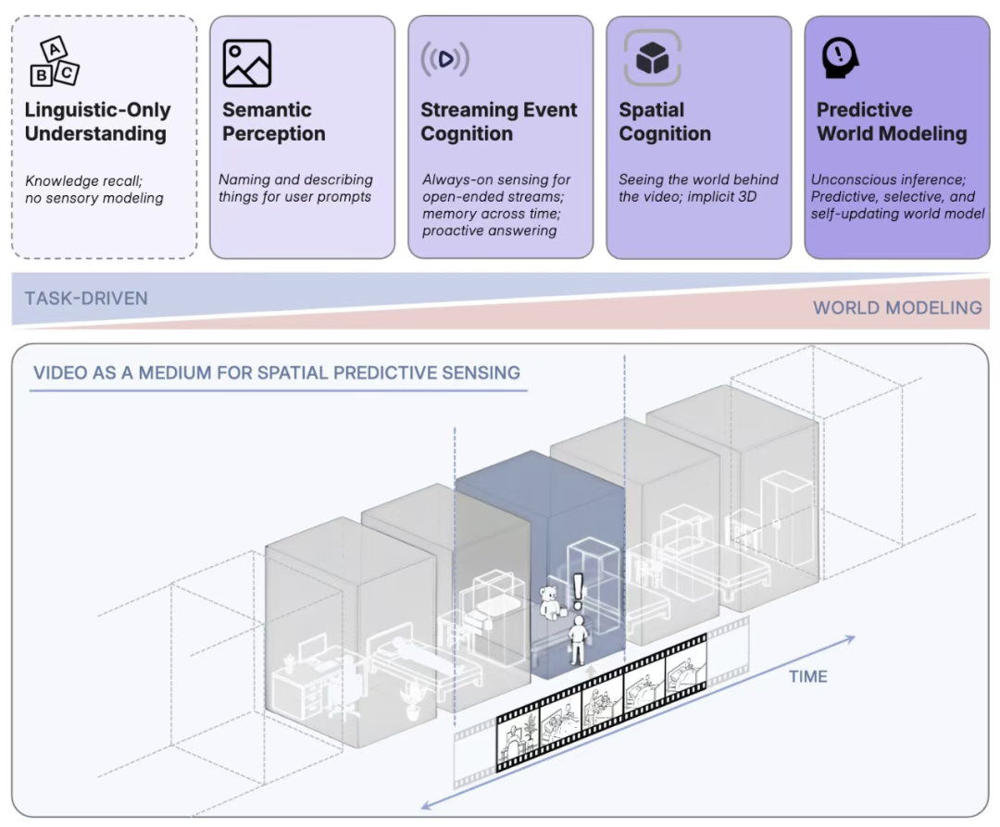{:width 800}
			- 团队尝试了一种**全新的原型 —— 预测感知（predictive sensing）**，在 Cambrian-S 上训练了一个潜变量帧预测（LFP）头。在推理过程中对**「惊讶度」（surprise）**进行估计，并以两种方式加以利用：
				- surprise-driven 的记忆管理 —— 压缩或跳过不令人惊讶的帧，将算力集中在令人惊讶的帧上；
				- surprise-driven 的事件分割 —— 利用惊讶值的峰值来检测事件边界或场景变化。
			- 通过利用这种内部预测模型产生的信号，团队在空间认知任务上看到了令人鼓舞的提升。这虽然只是一个**玩具级的预测世界模型**，但借助这种机制，团队的中小型模型在新提出的 **VSI-Super（Visual-Spatial Intelligence）基准**上超越了 Gemini。
			- 谢赛宁表示，这是一篇很长的论文，但其中有许多非常有趣的细节。如果你正在研究视频多模态模型，这篇论文或许值得一读。虽然并不确定团队的方向是否正确，但他确信当下的范式还远远不够。
		- ## 基准测试空间超感知
		  collapsed:: true
			- 为追求「空间超感知」奠定基础，首先需要确定如何衡量该能力。研究者对这一能力的基准测试进行了两部分研究。
			- 研究者首先审计了一套流行的视频 MLLM 基准。其分析（图 3）显示，现有基准绝大多数侧重于语言理解和语义感知，而忽视了「超感知」所需的更高级空间和时间推理。
			- 图3
			  id:: 6916f83e-9289-4eed-b9c4-f6299fb4fab4
				- 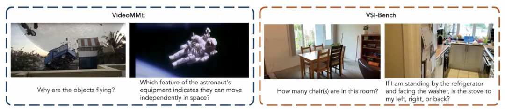{:width 800}
			- 为解决这一关键差距，该研究接着引入了 VSI-Super。这是一个新的基准，专门用于在任意长的流式场景中探测空间智能的这些更困难、更连续的方面。
			- 本文的其余部分将使用此基准来测试当前 MLLM 范式的极限。
			- ### 解构现有的视频基准
			  collapsed:: true
				- 近年来 MLLM 的进步导致了视频问答（Video-QA）基准的激增。然而，一个关键问题随之产生：现有基准在多大程度上真正检验视觉感知能力，而不仅仅是测试语言先验？
				- 该研究的诊断测试通过改变视觉输入的丰富性和文本提示的信息量，试图解开模型对视觉感知与语言先验的依赖关系。那些仅靠纯文本输入（如字幕或「盲」MLLM）就能解决的基准，更偏向于检验语言理解；而需要多帧输入才能回答的问题，则要求真正的视觉感知。
				- 研究者使用一个基于图像的 MLLM Cambrian-1 进行评估，此举旨在探测潜在的任务需求，而不将其与特定视频架构和后训练方法的能力相混淆。
				- 研究者为向 Cambrian-1 模型输入视频设立了几种实验条件：
					- **Multiple Frames (多帧)**: 模型处理从视频片段中均匀采样的 32 帧。这是文献中表示视频输入的标准方法。
					- **Single Frame (单帧)**: 模型仅处理给定视频片段的中间帧。此条件测试对最少的、上下文核心的视觉信息的依赖程度。
					- **Frame Captions (帧字幕)**: 模型不接收视频帧，而是接收对应于相同 32 帧均匀采样图像的字幕。此条件旨在揭示在没有低层感知基础的情况下，任务的可解决程度。使用 Gemini-2.0-Flash API 来为视频帧重新生成字幕。
				- 为了在这些条件下对性能进行情境化分析，该研究还引入了两个基线：
					- **Blind Test (盲测)**: 模型仅使用任务的问题来尝试解答。所有视觉输入都被忽略，也不使用视觉字幕。该基线测量模型基于其预先存在的知识、语言先验以及基准问题中任何潜在偏见的性能。
					- **Chance Acc (随机准确率)**: 这代表了特定任务格式（例如，多项选择题）通过随机猜测可实现的准确率，作为性能的下限。
				- 图2
				  id:: 6916f90f-5cb3-4c56-bd5d-296fa5373efe
					- 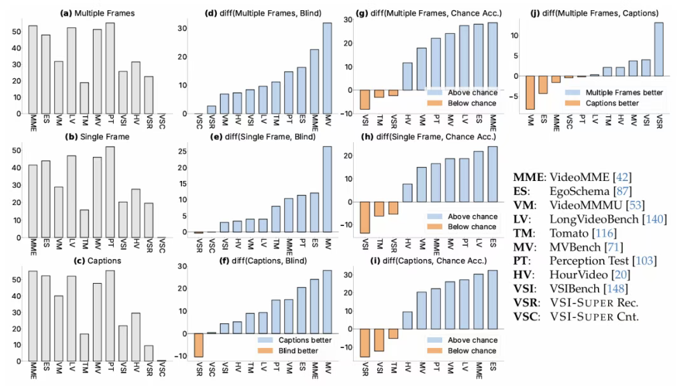{:width 800}
				- 图 2 (a-c) 的结果表明，Cambrian-1 作为一个未经任何视频后训练的、基于图像的 MLLM，可以在许多基准上达到合理的性能。这表明，这些基准所针对的大部分知识，都可以通过标准的单图像指令调优管线来获取。然而，在 VSI-Bench 和 Tomato 这两个数据集上，该模型的性能低于随机水平，因为它们分别需要真正的视频感知和对高帧率视频的细粒度理解。
				- 使用文本字幕代替视觉输入也产生了显著的性能提升，在 EgoSchema、VideoMME、LongVideoBench、VideoMMMU、Perception Test 和 MVBench 等基准上，其准确率超过随机水平 20% 以上（图 2 i）。在将基准性能与「盲测」结果进行比较时，也可以得出类似的结论（图 2 d, f）。这种性能表现意味着，这些基准主要探测的是可从视频内容的文本摘要中推断出的能力。
				- 解读使用「多帧」和「帧字幕」之间的性能差异（图 2 j），一个显著的正差值（偏向于多帧输入）标志着该基准对精细视觉感知的需求。相反，一个很小或负的差值（更偏向于「帧字幕」）则表明其具有更强的以语言为中心的性质。研究者的分析将 VideoMMMU、EgoSchema、VideoMME、Perception Test 和 LongVideoBench 归于后一类，表明它们可能更依赖于语言理解而非视觉提示。一个显著的例外是 VSC，它对当前的 MLLM 来说是如此具有挑战性，以至于所有三种输入条件都产生接近于零的性能，从而排除了它们之间任何有意义的比较。
				- >  现有的基准绝大多数侧重于语言理解和语义感知，而忽视了「超感知」所需的更高级的空间和时间推理。
				- 研究者希望强调基准测试中固有的挑战，以及创建一个单一的、包罗万象的基准来评估每一种能力是不切实际的。
					- 例如，对语言先验的依赖不应仅仅被视为一个缺点，因为获取丰富的世界知识并对其进行有效检索在许多场景中无疑是有益的。研究者认为，视频基准不应被视为衡量一个单一、统一的「视频理解」概念。相反，它们的设计和评估应基于它们旨在评估的特定能力。因此，上述分析旨在指导开发能更有效推动「空间超感知」发展的任务，这也将是本文余下部分的中心焦点。
			- ### VSI-SUPER：迈向多模态大型语言模型中空间超感知的基准测试
			  collapsed:: true
				- 参照图 1 ( ((6916f707-1b29-462d-b26c-3eca20dc59b7)) ) ，空间超感知要求 MLLM 具备四种关键能力：**语义感知、流式事件认知、隐式 3D 空间认知和预测性世界建模**。
				- 然而，正如研究者在图 2 ( ((6916f90f-5cb3-4c56-bd5d-296fa5373efe)) ) 中的分析所概述的，大多数现有的视频问答（QA）基准主要评估语言理解和语义感知方面，这些方面更具反应性，并由特定任务驱动。==虽然近期的研究已开始通过持续感知、记忆架构和主动回答来解决流式事件认知问题，但这种能力通常是在测试时「工程实现」的，而非原生的模型技能。==
				- 此外，尽管空间推理偶尔会作为现有基准中的一个类别出现，但这些任务很少达到真正空间认知的水平，并且远未探测定义「超感知」的世界建模能力（图 3 ( ((6916f83e-9289-4eed-b9c4-f6299fb4fab4)) ) ）。尽管 VSI-Bench 向着检验空间认知迈出了第一步，但其视频仍然是短片和单场景的，并且它既没有对问题进行形式化定义，也没有评估世界预测建模这一基本能力。
				- 为了阐明当前 MLLM 与空间超感知之间的差距，研究者引入了 **VSI-SUPER**，这是一个由两部分组成的、用于连续空间感知的基准。这些任务对人类来说是直观的，通常很容易，即只需观看并持续追踪发生的事情，但它们对机器来说仍然具有惊人的挑战性。它们要求跨越无界的空间视频，选择性地过滤和结构化地积累视觉信息，以保持连贯的理解并回答问题。重要的是，它们能够抵御「暴力」的上下文扩展，暴露了对真正空间推理的需求。下面将详细介绍这两个组成部分。
				- **VSI-SUPER Recall (VSR)：长时程空间观察与回忆**
				  collapsed:: true
					- VSR 基准要求 MLLM 观察长时程的时空视频，并按顺序回忆出一个异常物体的位置。
					- 如图 4 所示，为了构建这个基准，人类标注者使用图像编辑模型（即 Gemini）将令人惊讶或不合时宜的物体（例如，一只泰迪熊）插入到一个室内环境的 walkthrough 视频的四个不同帧（和空间位置）中。
					- 图4
						- 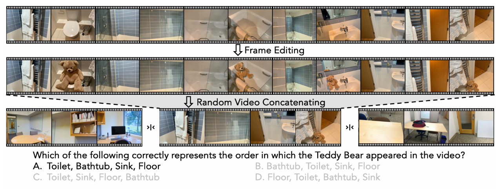{:width 800}
					- 然后将这个编辑过的视频与其他类似的房间游览视频拼接起来，创建一个任意长的连续视觉流。这项任务类似于语言领域中常用于压力测试 LLM 长上下文能力的「大海捞针」（NIAH）测试。类似的 NIAH 设置也已被提议用于长视频评估。
					- 然而，与那些插入不相关文本片段或帧的基准不同，VSR 通过帧内编辑保持了「针」的真实感。它通过要求顺序回忆（这实际上是一个多跳推理任务）进一步扩展了挑战，并且在视频长度上保持了任意的可扩展性。为了全面评估模型在不同时间尺度上的性能，该基准提供了五种时长：10、30、60、120 和 240 分钟。
				- **VSI-SUPER Count (VSC): 变化视角和场景下的持续计数。**
					- 测试 MLLM 在长篇空间视频中持续积累信息的能力。为了构建 VSC，研究者拼接了来自 VSI-Bench 的多个房间游览视频剪辑，并要求模型计算所有房间中目标物体的总数（见图 5）。
					- 图5
						- 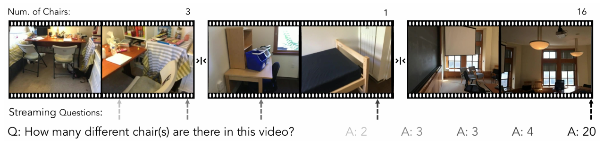{:width 800}
					- 这种设置具有挑战性，因为模型必须处理视角变化、重复目击和场景转换，同时还要保持一个一致的累积计数。对人类来说，计数是一个直观且可泛化的过程。一旦理解了「一」的概念，将其扩展到更大的数量是很自然的。相比之下，正如研究者稍后将展示的，当前的 MLLM 缺乏真正的空间认知，并且过度依赖于学到的 statistical patterns（统计模式）。
					- 除了标准评估（即在视频结束时提问），研究者还在多个时间戳查询模型，以评估其在流式设置中的性能，其中 VSC 的正确答案会随时间动态演变。为了检验长期一致性，VSC 包括四种视频时长：10、30、60 和 120 分钟。对于这项定量任务，研究者使用平均相对准确率（MRA）指标来报告结果，这与 VSI-Bench 的评估协议一致。
			- ### 最先进的模型在 VSI-SUPER 上表现不佳
			  collapsed:: true
				- 为了测试 VSI-SUPER 是否对前沿 MLLM 构成了真正的挑战，研究者评估了最新的 Gemini-2.5-Flash。
				- 如表 1 所示，尽管上下文长度达到了 1048576 个 token，该模型在处理两小时视频时仍达到了其上下文限制。这凸显了视频理解的开放式（open-ended）特性，即连续的流实际上需要一个「无限输入，无限输出」的上下文，并且可以任意增长，这表明仅仅扩大 token 数量、上下文长度或模型大小可能还不够。
				- 表1
				  id:: 6916fcc6-a17b-49db-a5c2-fb60bccca2f4
					- 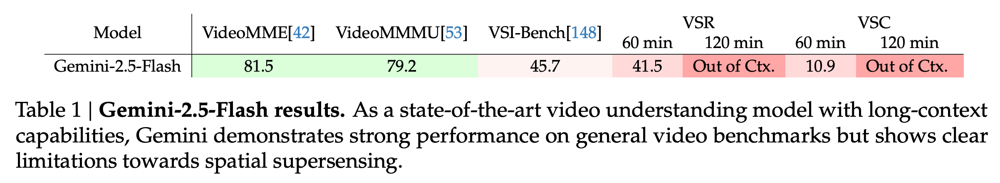{:width 800}
				- 尽管研究者的基准是合成的，但它反映了空间超感知中的一个真正挑战：人类能毫不费力地整合和保留来自持续数小时或数年的感官体验中的信息，但当前模型缺乏用于持续感知和记忆的相应机制。Gemini-2.5-Flash 在以语义感知和语言理解为重点的视频基准（如 VideoMME 和 VideoMMMU）上表现出强劲性能，实现了约 80% 的准确率。
				- 然而，即使是在其上下文窗口之内的 60 分钟 VSI-SUPER 视频上，VSR 和 VSC 的性能仍然有限 —— 分别只有 41.5 和 10.9。如图 6 所示，模型预测的物体计数未能随视频长度或物体的真实数量而扩展，而是饱和在一个很小的恒定值，这表明其在计数能力上缺乏泛化性，并依赖于训练分布的先验。
				- 图6
					- 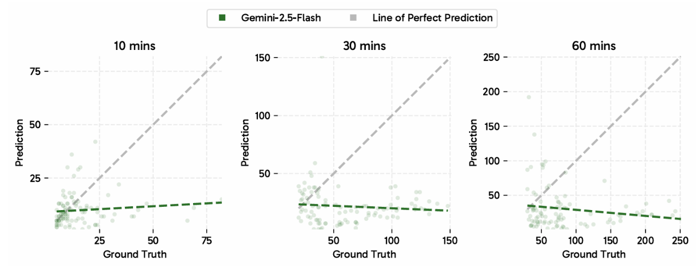{:width 800}
					-
			- ### VSI-SUPER 如何挑战当前范式
			  collapsed:: true
				- 尽管任务设置很简单，但 VSI-SUPER 带来的挑战超越了空间推理本身，揭示了当前 MLLM 范式的根本局限性。
				- **VSI-SUPER 任务挑战了那种认为「仅靠规模扩张就能保证进步」的信念。**
					- 通过允许模拟流式认知动态的任意长度的视频输入，VSI-SUPER 被有意构建为超越任何固定的上下文窗口。这种设计表明，逐帧的 tokenization 和处理不太可能成为一个计算上可行的长期解决方案。人类通过选择性地关注并（通常是无意识地）仅保留一小部分感官输入，来高效地、自适应地解决此类问题。这种预测性和选择性机制是人类认知的核心，在当前的 MLLM 中仍然缺失，但它对于一个预测性世界模型至关重要。
				- **VSI-SUPER 任务要求在测试时泛化到新的时间和空间尺度。**
					- 例如，VSC 要求在任意长的视频中进行计数，这类似于理解了计数概念的人类，可以将其扩展到任何数量。关键不在于维持一个极长的上下文窗口 —— 人类并不会保留扩展视觉体验中的每一个视觉细节 —— 而在于学习计数这一过程本身。预测性感知通过将连续的视觉流分割成连贯的事件，并利用「惊讶度」的时刻来施加时间结构，从而促进了这一点。这种分割充当了一种「分而治之」的机制，允许模型在动态变化的场景中决定何时开始、继续或重置行为。
					- 总之，这些挑战跨越了计算效率、泛化能力以及诸如无意识推理和预测性感知等认知机制，呼唤着一场范式转变。未来的模型不应仅仅依赖于扩展数据、参数或上下文长度，而应学习能够在一个跨越时空、无限展开的视觉世界中进行感知和预测的内部世界模型。
					- 为了进一步推动这一范式转变，下一节将探讨在当前范式内，通过改进工程设计和有针对性的数据筛选，还能取得多大进展。研究者将评估现有的 MLLM 框架是否能被改造以应对 VSI-SUPER 带来的挑战。这些努力虽然在现行框架的限制内运作，但对于为下一代空间超感知模型构建数据和实证基础而言，是必不可少的。
		- ## 预测性感知：一种新范式
		  collapsed:: true
			- Gemini-2.5-Flash (表 1 ( ((6916fcc6-a17b-49db-a5c2-fb60bccca2f4)) ) ) 和 Cambrian-S (表 7) 在 VSI-SUPER 上的性能都急剧下降，这揭示了一个根本性的范式差距：仅靠扩展数据和上下文不足以实现超感知。
			- ==研究者提出将预测性感知作为一种前进的路径，即模型学习预测其感知输入，并构建内部世界模型来处理无界的视觉流。这一设计受到了人类认知理论的启发。与当前标记化并处理整个数据流的视频多模态模型不同，人类的感知（和记忆）具有高度选择性，只保留一小部分感知输入。大脑不断更新内部模型以预测传入的刺激，压缩或丢弃那些不贡献新信息的、可预测的输入。相反，违背预测的意外感知信息会产生「惊讶度」，并驱动注意力和记忆编码的增强。==
			- 研究者通过一种自监督的下一潜在帧预测方法来构建这一概念的原型。由此产生的预测误差可作为两个关键能力的控制信号：用于选择性保留重要信息的内存管理，以及用于将无界流分割成有意义的块的事件分割。研究者通过在 VSI-SUPER 上的两个案例研究证明，该方法显著优于强大的长上下文和流式视频模型基线。
			- ### 通过潜在帧预测实现预测性感知
			  collapsed:: true
				- 研究者通过一个轻量级的、称为潜在帧预测 (LFP) 头的自监督模块来实现研究者的预测性感知范式，该模块与主要的指令微调目标联合训练。这是通过修改第 4 阶段的训练方案来实现的：
				- **潜在帧预测头**。
					- 研究者引入一个 LFP 头，这是一个与语言头并行运行的两层 MLP，用于预测后续视频帧的潜在表征。该架构如图 9 左上角所示。
					- 图9
						- 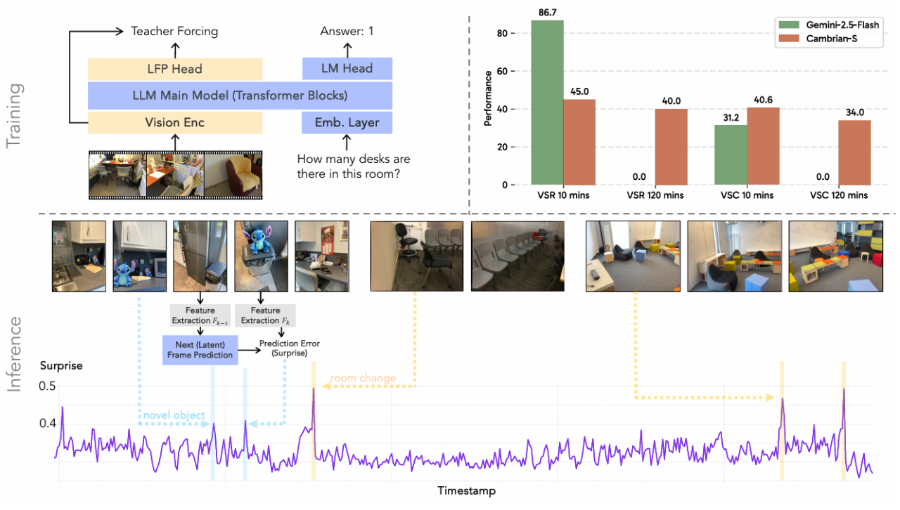{:width 800}
				- **学习目标**。
					- 为了优化 LFP 头，研究者引入了两个辅助损失：均方误差 (MSE) 和余弦距离，用于衡量预测的潜在特征与下一帧的真实特征之间的差异。一个权重系数用于平衡 LFP 损失与主要的指令微调下一令牌预测目标。
				- **LFP 训练数据**。
					- 研究者使用来自 VSI-590K 的一个 290K 视频子集来扩充第 4 阶段的数据，该子集专用于 LFP 目标。与指令微调不同，这些视频以 1 FPS (每秒帧数) 的恒定速率采样，以确保潜在帧预测具有均匀的时间间隔。
				- 在修改后的第 4 阶段微调期间，研究者以端到端的方式联合训练连接器、语言模型以及语言头和 LFP 头，同时保持 SigLIP 视觉编码器冻结。所有其他训练设置与原始的第 4 阶段配置保持一致。为简洁起见，在后续实验中，使用 LFP 目标联合优化的模型仍被称为 Cambrian-S。
				- 推理：通过预测误差估计「惊讶度」。
					- 在推理过程中，研究者利用训练好的 LFP 头来评估每个传入视觉感知输入的「惊讶度」程度。在心理学中，该框架通常被称为违反预期 (VoE) 范式。具体来说，视频帧以恒定的采样率（除非另有说明，否则为 1 FPS）输入到 Cambrian-S 中。模型不断预测下一帧的潜在特征，随后研究者测量模型的预测与该传入帧的实际真实特征之间的余弦距离。
				- 该距离可作为**惊讶度的定量测量**：
					- 值越大，表示偏离模型习得预期的程度越大。这种惊讶度分数可作为后续下游任务的强大、自监督的指导信号。
			- ### 案例研究 I：用于 VSI-SUPER 计数的惊讶度驱动的连续视频分割
			  collapsed:: true
				- 超感知的更严峻测试不止于回忆的能力，还涉及模型解释感知输入、在不同环境中导航以及执行累积的多跳推理的能力。
				- **惊讶度驱动的事件分割**。
					- 一个事件可以被理解为一个时空上连贯的经验片段。在空间超感知的背景下，一个事件对应于置身于特定空间并感知其环境的连续体验。该定义强调，真实的感知体验通常被组织成局部连贯的片段 —— 即感知、空间和时间特征保持相对稳定或一致的情节。因此，事件分割是基于这种连贯性的变化，将连续的感知输入流解析为离散的、有意义的单元的过程。这种分割对于推理和行为至关重要：它允许智能体（生物的或人工智能的）形成经验的结构化表征，检测发生重大变化的边界，并相应地更新对环境的预测。最近的研究强调，预测误差和工作记忆 / 上下文的变化是驱动分割的两种可能机制。
					- 在 VSI-SUPER 计数 (VSC) 基准中，研究者研究了一个简单的设置，其中使用惊讶度来分割连续的视觉输入，将场景变化识别为自然断点，从而将视频流划分为空间上连贯的片段。这种方法也类似于人类解决问题的方式：当在广大区域内计算物体时，人们通常一次只关注一个部分，然后再合并结果。这种行为也与「门口效应」有关，即穿过门口或进入一个新房间会在记忆中创建一个自然边界。如图 12 所示，模型在事件缓冲区中不断累积帧特征。当检测到高惊讶度帧时，缓冲的特征被汇总以产生一个片段级别的答案，然后清除缓冲区以开始新的片段。这个循环一直重复直到视频结束，之后所有片段的答案被聚合适形成最终输出。
					- 图12
						- 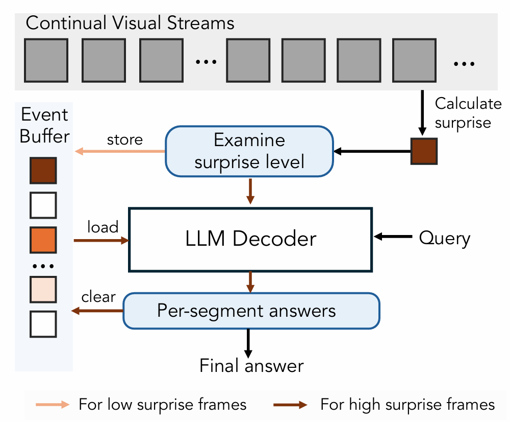{:width 400,:height 800}
				- **结果**。
					- Gemini-1.5-Flash 在 VSC 上的表现接近零（图 13a），显示了该任务的难度。尽管 Gemini-2.5-Flash 在 10 分钟视频上取得了更好的结果，但其性能在更长的视频上迅速下降。
					- 相比之下，Cambrian-S (带惊讶度分割) 使用的惊讶度驱动的事件分割方法在所有视频长度上都取得了更高、更稳定的性能。当使用真实的场景切换来分割视频时（即 Cambrian-S 带 GT 分割），性能进一步提高，这代表了一个近似的上界。
					- 图13
						- 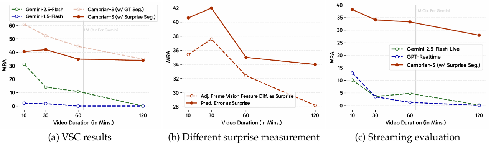{:width 800}
					- 图 14 的更深入分析显示，Gemini-2.5-Flash 的预测被限制在一个有限的范围内，并且不会随着视频中出现更多物体而扩展。相比之下，Cambrian-S (带惊讶度分割) 产生的计数虽然尚未完全准确，但与真实物体数量表现出更强的相关性，表明其具有更好的泛化能力。
					- 图14
						- 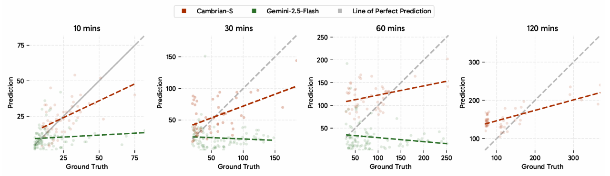{:width 800}
				- **惊讶度测量的消融实验**。
					- 研究者将研究者的惊讶度驱动方法与使用相邻帧特征相似度的基线进行了比较（图 13b）。对于这两种方法，研究者都报告了经过超参数调优后的最佳结果。与研究者在 VSR 中的观察一致，在所有视频时长上，使用预测误差作为惊讶度的测量标准，其性能始终明显优于外观相似度。
	- ---
	- [聊聊最近一篇模型内在似然结构分布锐化论文](https://www.xiaohongshu.com/explore/690a955e000000000700d459?note_flow_source=wechat&xsec_token=CBcDhv4g2HIl4Z-ROSVZJixT_6rnDNz_NQ0lcq9SXkItg=)
	  collapsed:: true
		- 副标题：来自哈佛Reasoning with Sampling对模型内在似然结构分布的锐化
		- 最近，一篇来自哈佛大学的论文《Reasoning with Sampling: Your Base Model is Smarter Than You Think》给业界带来了一种新的观点：==仅通过改进推理阶段的采样策略，而不依赖任何额外的训练、奖励模型或强化学习，就能显著提升大语言模型在推理任务上的表现，甚至达到或超越经过强化学习后训练模型的水平。==
		- 不过网络上似乎有一种说法似乎将论文中所采用的幂分布（power distribution）采样完全与RL划等号，或取而代之，甚至强调RL微调（如GRPO）带来的推理提升，并非“创造”了新能力，而是将基础模型中已存在的高似然推理路径“锐化”出来，这种“锐化”可以通过在推理阶段从基础模型的幂分布中采样来实现，无需任何训练或奖励信号。
		- 当然，从论文的实验对比数据来看，确实这种对基础模型做幂变换的方法看起来确实能够在大多数情况等效于RL过程中对模型高似然分布的锐化，但我想对于一些更复杂推理路径的探索、反直觉的一些创新以及泛化迁移等方面，结合RL探索与利用的本质还是有着很大本质不同的，也与其它test-time scaling方法有着较大差异，不过这并不失于一种简单高效的方法，也可以作为未来模型对于复杂推理任务或后训练中的数据合成打开一定的思路。
		- 这也为我们引出接下来的思考：在RL过程中是否完全与这种序列似然结构的优化（分布锐化）完全等价？或者进一步的说：起始于什么样的基础模型能力或训练阶段→止于何种推理模式在满足不同问题复杂程度泛化能力表现区间上两者是等价的？
		- 更多详细内容，请大伙参见长图笔记↑
	- #agent #multi-agent [百度智能云带领FM Agent团队重磅突破！横扫 AI 科研四大领域，刷新 3 大权威基准，多智能体时代已来](https://mp.weixin.qq.com/s/hVlFvuGt0GeTWIsFP7cWUQ)
	- #prompt [如何自动优化领域任务的提示词？用EGO-Prompt｜NeurIPS 2025](https://mp.weixin.qq.com/s/-skZZa0ryr6jNgyRNef-TA)
	-
- [[Blogs]]
	- [[#blue]]==感觉这个 "[幸运降临中](https://www.xiaohongshu.com/user/profile/5f96bb470000000001009db4?channel_type=explore_feed&parent_page_channel_type=web_profile_board&xsec_token=ABpkmQj1NrSEY2kLYRvffCoNbLCmlpYZ_nPkf1snpIV1I=&xsec_source=pc_feed)" 还讲得挺好的~ 建议 [[qinqin]] 看~==
		- [Prompt论文已死，拥抱Scaling Training](https://www.xiaohongshu.com/explore/68e942a9000000000402adf7?app_platform=android&ignoreEngage=true&app_version=9.8.0&share_from_user_hidden=true&xsec_source=app_share&type=normal&xsec_token=CBHBDXvZbhB_sPpyQcTw_fbUMHgrApiZoKs_S-BraKK18=&author_share=1&xhsshare=WeixinSession&shareRedId=N0cyQ0ZLODlKSTdHPzgzOTpJTkBJRjpA&apptime=1763099030&share_id=7a84ac1e4bfc446896bca905ae17257b&share_channel=wechat&wechatWid=c80dd9bbd8fcf5645bfd0c8ad373fc0e&wechatOrigin=menu)
		  collapsed:: true
			- 在COLM的Reasoning Workshop听了Google DeepMind研究人员的talk，感慨颇多。
			- 回想2年前刚做LLM的时候，顶会论文许多都在玩Prompt Design，CoT，ToT，Self-consistency，Plan and solve，program solving....
			- 当时1个prompt+n个benchmark的刷榜就能发到ACL EMNLP这样的NLP顶会。
			- 自从24年底-25年初（尤其是R1出来以后），大家开始搞Reasoning Scaling，并发出随着训练增长，LLM自己可以产生之前需要精心设计的Prompt才能获得的特殊效果和生成风格。
			- 现在，Prompt的论文还能继续做吗？
			- ==我认为单纯改词+刷榜已经没有什么价值了，有用的或许是从底层原理上解释为什么某一类Prompt可以work。==
			- 例如，其实很多Prompt本质上都是CoT，但是为什么CoT可以work？如何更好的理解内部的信息流？（已经有很多论文）
			- 与之互补的是还有一些Prompt本质上通过重复问题token提高LLM对问题的理解，但是==为什么这样操控black box有效呢？是优化了attention？还是预训练的bias？==
			- ==这样研究的Insight可以反过来融合到Training中，获得更好的Reasoning。==
			- 此外，我们还可以把1个Prompt包装成为很多个Prompt，然后造一个名词叫做“Agent”。当然这只是我之前读Agent论文的感受，如果现在Agent已经进化了欢迎评论区讨论。
			- 我感觉所有Training Free的方法都可以在理想资源下被Training超越，未来学术界只能跟在工业界身后做改进了吗？
		- [解锁LLM Initial Token Attention Sink力量](https://www.xiaohongshu.com/explore/6830f2770000000021003432?note_flow_source=wechat&xsec_token=CBMH_CLoQ3dPNYJHEbRbELxuig3QS66k00Ljxyd3HY-oQ=)
		  collapsed:: true
			- 最近很多顶会都在研究这个，简单来说就是==观察到了Decoder-Only LLMs的第一个 token （如 <BOS>）有一系列异常现象，然后大家都在思考这些现象的原理，以及如何利用这个特殊的token提高LLMs的能力。==
			- ### 方向1：观察到三大极端现象
				- **注意力汇聚（Attention Sink）**
					- 23年cmu的一篇论文就发现了，第一个 Token 通常吸收远高于其他 Token 的注意力，成为多个注意力头的关注中心。
				- **值状态枯竭（Value-State Drain）**
					- 与高关注度相对的是，这些 Token 的值状态（value states）的范数却异常低，远低于序列中其他位置。这意味着==尽管它们被广泛“关注”，实际传递的信息量却非常有限。==
				- **残差状态高峰（Residual-State Peak）**
					- 与值状态相反，==这些 Token 的残差状态（即 Transformer 层输出的表示）范数却非常高==。例如在 LLaMA 3.1-8B-Base 中，<BOS> 的残差状态在前30层中始终显著高于其他 Token。
			- ### 方向2：解释为什么会这样？（目前有四五篇论文在研究这个了）
				- **结构机制强化：**
					- 高注意力 → 值状态减弱 → 更吸注意力，形成自增强循环。
				- **位置信息驱动：**
					- 不论有没有 <BOS>，序列开头天然具备汇聚优势。
				- **因果掩码 + Softmax 加持：**
					- 第一个 Token 是所有后续 Token 唯一可见目标，自然成为关注焦点。
				- **LayerNorm 放大效应：**
					- 归一化机制放大了残差差异，进一步巩固其特殊地位。
			- ### 方向3：有何价值？
				- 性能优化：仅调整对第一个 token 的注意力就能显著提升模型表现。
				- 长文本处理：此token有助于记忆聚焦，改善长序列中的信息衰减问题，也可避免信息的Overmixing。
				- 结构解读与推理加速：有助于优化模型的量化、推理效率或结构设计。
			- ### 推荐几篇探索这个token的论文
				- CMU的Efficient Streaming Language Models with Attention Sinks, 首次发现第一个token吸收了大量attention，称之为attention sink现象
				- DeepMind的Why do LLMs attend to the first token? 深入探索这个token的作用，发现其可避免信息over-mixing
				- Upenn和AMD的ZeroTuning: Unlocking the Initial Token's Power to Enhance Large  Language Models Without Training利用这个token提高LLM在多个场景中的表现，提出了一种training-free的tuning方法。这篇论文发现：调节第一个token的Attention可以通过平滑或者sharpen后续token的注意力分布，改善llm的理解模式。由于其存在Attention Sink，因此调节这个token的Attention可以带来更明显的效果。
		- [Big Name + 海量实验 + 讲好故事 = Accept](https://www.xiaohongshu.com/explore/68f053ff0000000004028fdd?note_flow_source=wechat&xsec_token=CBkrk-lcD_2qfvJvmImcbjv12HhS9NOEiPGToRucq05wA=)
		  collapsed:: true
			- NeurIPS在2014年和2021年进行的一致性实验:
				- 10%的论文被随机分配给两组独立评审人，结果16-23%的论文因评审组不同而得到完全相反的决定（接收or拒绝），表明评审过程存在相当程度的随机性。
			- 分析ICLR 2017-2020年超过5000篇投稿发现，即便控制了评审评分，顶尖机构（特别是CMU、MIT和Cornell）的论文仍然获得更高的接收率。AC对知名作者和big name顶尖机构存在明显偏好，即使相同评审分数的情况下也是如此。提前在arXiv上发表的论文（这可能暴露作者身份）往往得到更好的评审结果，尤其当作者来自顶尖机构时。
			- 今天搜了很多ICLR上方向类似的论文学习。很多论文给我的感觉就是idea很古老且简单（既没有带来惊喜，也没有新的insight，也没有难度），属于很多人都能想到的低垂果实（包括AI）。
			- 只看这一点，审稿人可能不会给很高的分数。
			- 但是，这些论文无一例外包含了巨量实验（跑起来也只是费时间，没有什么难度），而且某几篇论文挂在arxiv上，单位是顶校+大厂big name。
			- 我猜许多审稿人现在会改变他们的分数了 (doge)
		- [AAAI +3 | LLM顶会"水"论文的思考🤔](https://www.xiaohongshu.com/explore/690e909b0000000004002d75?note_flow_source=wechat&xsec_token=CBDKcp5Yvj1_gtUbdcqWKWvm2ubHGgOS2dn72v7jJY3dE=)
		  collapsed:: true
			- 自己的都中了，挂名的全拒了[完啦R]
			- 做自己感兴趣的东西，不被约束，太爽了！希望读PhD的时候还能有现在的激情!
			- 下面总结两个我喜欢研究的AI方向，适合Independent Researcher或者学术界资源有限的来做。我做的这两个方向都中稿了。
			- 声明：不是为了水论文而水，不然就是学术污点得不偿失了，除非你之后不搞学术。我一直坚持认为论文的claim要严谨，即便只是一个简单的问题。所以下面我仅从我个人的经验分享做什么。因为我发现太多朋友和我一样在外面很“孤独”，connection上限低，又没钱，又没卡，但是仍然需要面对毕业或者申请的压力。积累一些原始资本后，我们才有更大的可能可以获得这些资源，进而做更有影响力的高质量工作。（我会在几年后考古和更新这个帖子）
			- ------正文：
			- **==首先，我认为[应用]方向的论文是最容易入门的。==**某Stanford PhD曾言：“每当我对理论方向科研丧失信心时，发一篇应用论文就能给我续一口命…”
			- > AI = 数据 + 模型 + 训练
			- 选择一个应用方向，从上面三个元素选择一个视角进行优化，就能做一篇很好的研究。
			- 如果你选择了一个很火的应用方向，企业学术界都在做。模型架构修改入门难度高，你一个人做研究也很难比过企业，训练资源也不如他们。这个时候就可以从数据入手，构建：
				- 1. 更高质量的数据
				- 2. 之前稀缺的数据
				- 3. 更高效准确的标注pipeline
			- 你可以模仿李飞飞做一个新的benchmark，或者提出一种新的数据标注范式（eg之前需要手标，你提出一种方法自动获得label）。缺点是这个过程需要大量时间成本。
			- 如果你做llm或者vlm，选择training free/inference time adaptation或许也不错。ICL/Steering/Calibration/Tuning attention/representation/logits......
			- **==但是此时的重点是能否从原理上自洽的解释你的方法为什么work。==**==你的贡献不仅仅是一个simple yet effective的方法，还是许多insights。这种论文首先分析一种现象，然后基于对这种现象的深入分析提出一种新方法。==
			- （不过我个人始终认为，在资源充足的条件下还是搞training吧，training终将激活一切training free能带来的收益。不过后者仍然可能在可解释性上占优）
			- 最后，从模型的视角，我感觉以Efficiency作为模型优化卖点也不错。例如：参数/token剪枝，decoding优化，模型蒸馏，skip layers..... （大量论文发现模型是冗余的，输入token是冗余的。架构不变，只能搞这些技术找补一下。5-10年后模型架构更换以后这些方法还需要吗？我无法预测）
			- 我感觉下面的公式容易讲故事：
				- > ==引入一个反直觉的现象。我们基于这个现象做了深入的分析，发现了一些insights。我们发现这些insights反过来可以被利用来优化模型。==
			- 这样研究，有novelty（因为反直觉），审稿人阅读起来容易看到之前没了解过的内容，读起来有趣。有许多类似论文的卖点是“几行代码实现多个benchmark涨点”，我很喜欢这种方法优雅且有理论支撑和深入解释的工作。
			- ------- 更新：
			- 再补充一个感觉容易被AI审稿人给positive意见的故事线。
			- 首先选择一个**==小众但是重要的方向==**，小众=参考文献很少，重要=满足顶会影响力的bar。你可以定义一个新的问题，应用新的模型，收集新的数据。但是论文里要体现“We are the first....”，也就是说你是这个冷门方向的冷门问题的第一人。这种论文的核心在于如何论述虽然你的方向冷门，但是重要。“第一人”效应在AI审稿时代会获得很高的credits，只要ai被你说服，而且因为冷门搜不到资料，所以你的novelty就是充足的[捂嘴笑R]
			- 何为冷门：数据收集困难；方向入门门槛高；偏工业届实践，所以学术界的不好想到；需要独特经历或背景才能想到的.... 想到别人想不到的问题本来就是novelty
			- 何为高影响力：如果这个方向能够被优化，则下游ABCD的应用都能被优化；提供的经验能被迁移到其他领域；之前其他类似领域的方法不能直接拿到你的方向用，你的方向具有特殊性，所以必须用你的研究才能解决......
			- 最后：
			  做热门方向的增量式研究容易被喷没有novelty
			  做冷门开创性研究容易被喷毫无意义没影响力
			- ==最好的策略是：做热门方向中的冷门子方向，兼得影响力和novelty。==
			- 至于如何识别哪个方向好，就得看你的导师，还有你自己的积累和兴趣了... 祝大家都能早日发够论文脱离苦海!
	- ---
	- #agent #memory [Agent的Memory不等于RAG](https://mp.weixin.qq.com/s/_Ds88lpCW042kWb6V04rrQ)
	  collapsed:: true
		- 我之前一直把Memory跟RAG混为一谈，现在才发现其实并不是一回事。
		- 回想一下，大部分人谈到Agent的Memory，经常用两个场景来举例
			- 1. 跟大模型说: hi, I'm Rock。在接下来的对话里再问，Who am I，这个例子虽然简单易懂，但完全没有实际价值
			  2. RAG，把静态文档“向量化”为大模型知识库，在每次Agent回答问题之前，先从向量数据库里检索一把，再让大模型回答。这让我这个外行产生一种错觉，以为RAG就是Memory
		- 但Context Engineering告诉我，RAG和Memory都是上下文的一部分，那如果RAG不是Memory，什么是Memory？
		- Langchain的《Memory for agents》说：从宏观层面来看，Memory是记录先前交互中的某些信息的系统，这对于打造优质的智能体体验至关重要。并且，Memory需要根据具体应用场景定制。
		- 这么看，==RAG只是Agent Memory的一种实现方式==，你可以把需要记忆的信息放在知识库文档里，再通过向量化的方式检索到。如果记忆需要更新，再由人类更新文档知识库。当知识量不大，并且不需要实时更新的时候，这种方案是可行的。 ==但如果知识量太大，或者要实时更新，就需要有其他的方案。==
		- Zep这个初创公司的创始人有一个视频讲《Stop Using RAG as Memory》，说到RAG的几个缺点，
			- RAG没有时间戳，你可能会检索到已经过时的知识
			- RAG没有办法解决冲突，当你检索到两篇意见完全相反的知识，RAG不会帮你处理
			- RAG更新周期太久，不能实时更新
		- 回到我们SRE Agent做预警任务根因分析的场景，就不太适合用静态文档做RAG，统一的知识库信息量太大，检索效率太低，且要用大量的时间维护知识库。
		- 更重要的一点是，如果我想要为每一个预警任务创建一个Memory，记录它历史处理结果，根据用户在处理过程中留下的只言片语来自动创建经验总结，那基本不可能手动维护在某个文档里。只能通过动态的方式更新Memory，这么看，Memory也可以不用向量数据库，完全可以用MySQL来搞定。
		- 法无定法，只要能解决问题，用什么都对
	- ---
	- [分享11篇近期觉得不错的blog](https://www.xiaohongshu.com/explore/690b56830000000004005411?note_flow_source=wechat&xsec_token=CBcQ67m6UYcfhZlBpuNRYKJcwB3i7hp0827rdbC6ORqyg=)
	  collapsed:: true
		- 第一篇blog是Gerardo自己文章的intro；( https://grdm.io/posts/bnn-without-bayes/ )
		- 第二篇是Hugging Face自己编写的playbook； ( https://huggingface.co/spaces/HuggingFaceTB/smol-training-playbook#introduction )
		- 第三篇是Krupa写的transformers intro. ( https://www.krupadave.com/articles/everything-about-transformers?x=v3 )
		- 第四篇也是一篇intro； ( https://ggrigorev.me/posts/introduction-to-parallelism/ )
		- 第五六篇都是偏theory的讨论； ( https://nanjiang.cs.illinois.edu/2025/11/02/overfit.html )
		- 第七篇是Sebastian对近年LLMs发展的summary. ( https://magazine.sebastianraschka.com/p/beyond-standard-llms )
		- 最后几篇是一些有意思的不那么学术的内容：
		- 第八篇是讲GPU结构及其工作原理的； ( https://www.aleksagordic.com/blog/matmul )
		- 第九篇是对NeuralPS 2025热点的分析； ( https://newsletter.languagemodels.co/p/the-illustrated-neurips-2025-a-visual )
		- 第十和第十一篇都是对AI economy的分析，对该议题持悲观态度的可以找How AGI became the most consequential conspiracy theory of our time那篇读。 ( https://peterwildeford.substack.com/p/ai-is-probably-not-a-bubble?r=qos5&utm_medium=ios&triedRedirect=true )
		-
		-
		-
		-
		-
	-